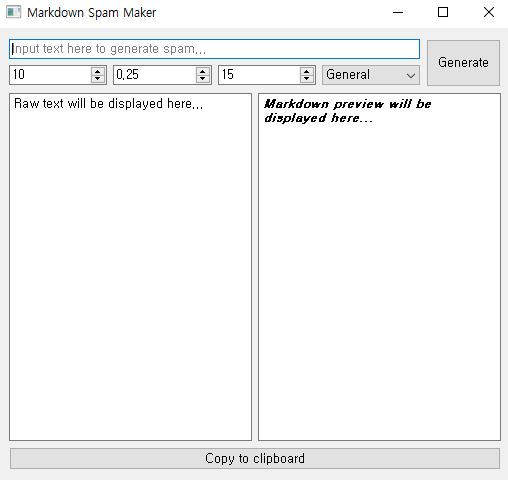

# MMM: Markdown Mayhem Maker
This makes messy, chaotic strings using markdown header.

___

## Breakline Threshold
Configures maximum characters in a row (includes blanks)

## Breakline Sensitivity
Configures how frequently break lines

## Max Row
Configures maxmum rows

## Type
| Type    | Description                                     |
|---------|-------------------------------------------------|
| General | Uses general markdown syntax (#, ##, ###)       |
| Discord | Uses additional markdown syntax in discord (-#) |